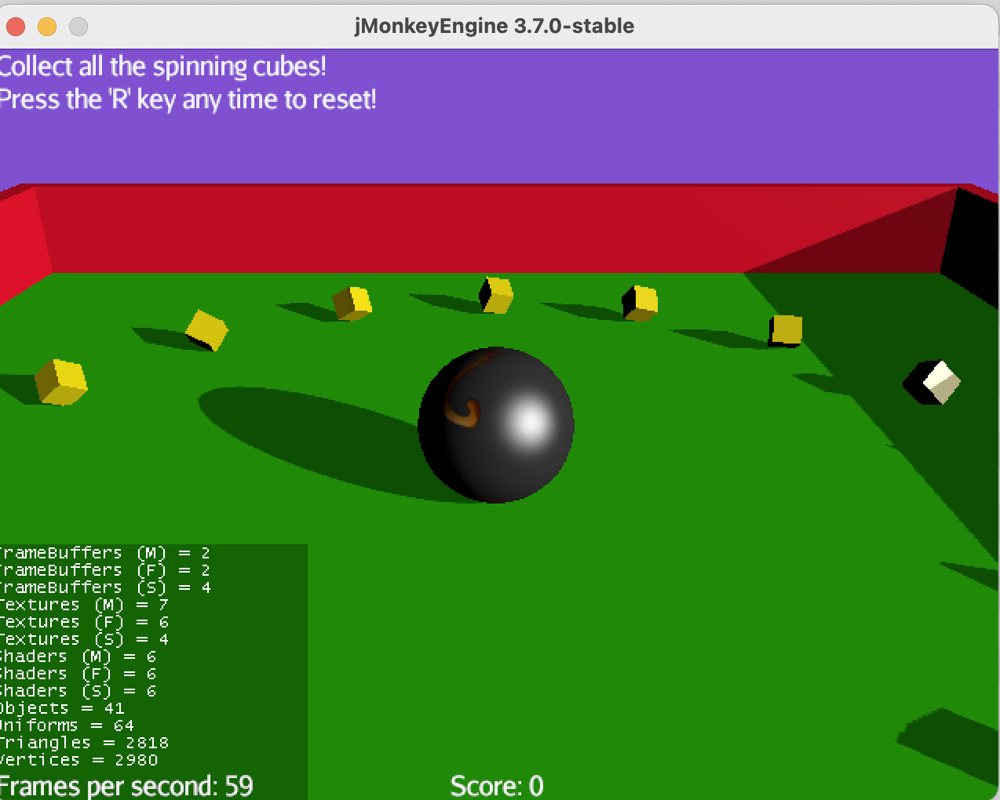

# iv4xr-jmonkey-demo

Contain a simple demo of writing an `aplib` test for a JME game.
  * [JME (JMonkey Engine)](https://jmonkeyengine.org/) is an open source game engine for Java --- [JME Github repository](https://github.com/jMonkeyEngine/jmonkeyengine).
  * [`aplib` is an agent-based framework](https://github.com/iv4xr-project/aplib) used for automated game testing.

As the demo we will use a simple JME game called _Rolling the Monkey_. The game is originally provided as [an example game by JME](https://github.com/jMonkeyEngine/jmonkeyengine/tree/master/jme3-examples/src/main/java/jme3test/games). For convenience, we have copied it into this project. A screenshot is shown below.

The game shows a bowling ball and a number of small boxes. The aim is to roll the ball to hit the boxes. Hitting a box will add 1 to the score (and remove the box from the game).

* The game is coded in the class [`RollingTheMonkey`](./src/main/java/cobaJMonkey/RollingTheMonkey.java).
* A minimalistic main-class to launch this game can be found in [`RollingTheMonkeyMain`](./src/main/java/cobaJMonkey/RollingTheMonkeyMain.java).

### Running the demo

* This is a Maven project. Import the project into Eclipse IDE.
* In Eclipse, change the project properties --> Java Build Path: add `./libs/JME/jMonkeyEngine3.jar` as an external jar to the project build path.
* Then run the demo-test-class (see below) as a Junit test.

### Sample `aplib` test

A simple example of an `aplib` test can be found in the class [`Test_RollingTheMonkey`](./src/test/java/cobaJMonkey/Test_RollingTheMonkey.java).
The class contains one test-method named `test_SUT_exampeleUsingAplib`. Run this method as a Junit test.

The method performs the following test scenario is as follows:

   1. At the game start, the bowling ball is dropped from some height. Wait first until the ball is on the table surface.
   1. Steer the ball until it hits box nr 3.
   1. During this scenario the test checks:
       * at the beginning there are 16 boxes, and the player's score is 0.
       * after box-3 is hit, we check that the box is removed from the game, and the score is now 1.

The test passes if the scenario can be completed and the two checks above are passed. Else the tests fails.
